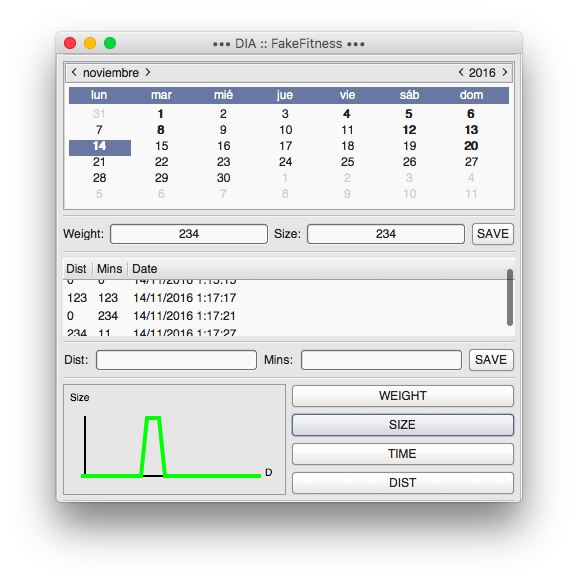

# Fake Fitness.

## Racionalización.
- Aplicación para el control personal del físico.
- Primer contacto con las tecnologías utilizadas y stand-alone.

> **Tecnologías utilizadas:** *CSharp, GtkSharp.*

## Capacidades.
- Gestión de medidas.
- Gestión de ejercicios.
- Visualización textual por días.
- Visualización gráfica por meses.

## Resultado.
